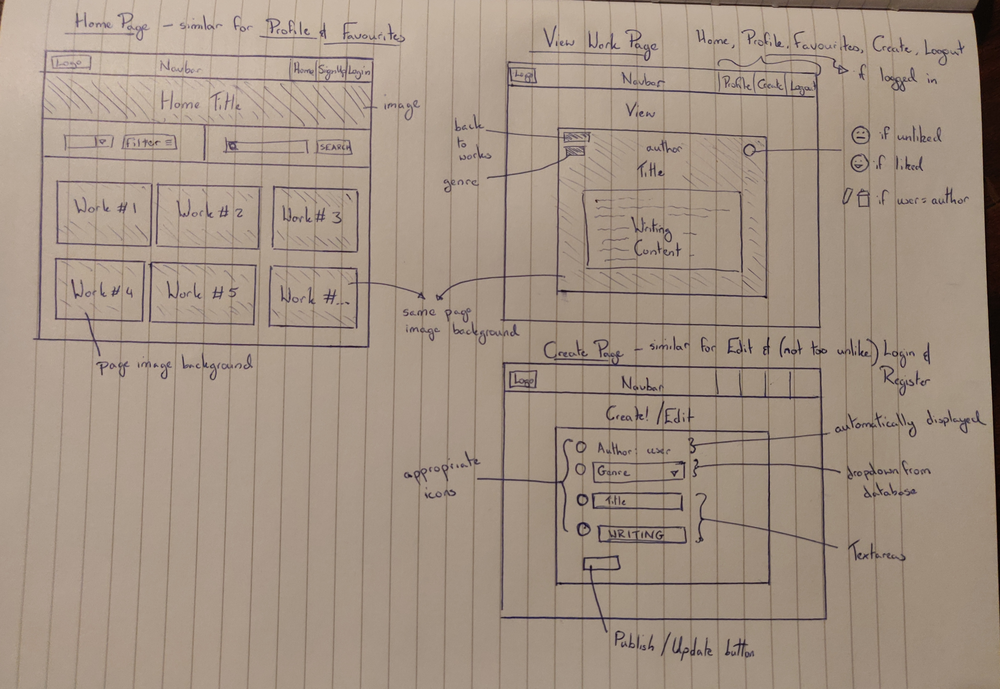

# Milestone Project 3 - Data Centric Development
## WriteIn

## Project Description
The requirements of this project was to build a MongoDB-backed Flask web app that would allow users to create, locate, display, edit and delete records. 
The vision for this web app was to design a social platform for writers, where writer's of all levels could connect, support and provide feedback to each other in a positive, non-competitive environment.
Poets, screenwriters, playwrights, authors and casual writers of all types would be encouraged to share their thoughts and talents on the platform.
The first version of this app was to provide login functionality, a place for the public to view all writer's work (home page - accessible to everyone), a profile page (currently private to the user to view their own work only) and a favourites page (where they can "collect" other writer's work).
Future versions would include the ability to comment on other's works (if the author opted for feedback) and the ability to view other people's profiles and writing history, to increase authors' visibility and collaboration.  

## UX
### Layout
The image below details the basic plan for the original layout. While the design was developed as a mobile-first design, the target device in this wireframe was a larger screen.

The main types of pages were:
1. Display Works pages (Home, Profile, Favourites)
2. View Individual Work (View page)
3. Form pages (Create, Edit, Register, Login)

- Display Works pages - display writings on a page image backgound in preview form
- View Individual Works - display work (via id) in full format - including tab spacing, etc. Work can be "liked"/"unliked" here. Can access edit/del functions from this page.
- Form pages - where information is submitted to database

### Colour Palette
As the target audience is writers, the colours resembling parchment (off-white) and traditional leather book binding (deep red and brown) were chosen.

### Images
For the banner image on the home page, an image of a fountain pen was chosen to keep with the writing theme. A photo of parchment was used as the background image to all the writing works. Bookcase images were used on the Profile and Favourites pages as both html pages contain "collections" of works.

### Fonts
The concept of the fonts was to represent both the traditional hand-written form and printed as harmoniously as possible. Headings were given the more cursive font of Tangerine while the body of the writings were displayed in Roboto.

### User Journey
The following user stories were identified:
1. "As a professional writer, I'd like a user friendly platform to connect different types of writers."
2. "As a new writer, I'd like feedback from more experienced writers without having to get professionally published yet."
3. "As someone who would like to write, but doesn't know where to start, I'd like somewhere unintimidating to dabble and practise writing."

Based on the first story, the app was developed to cater to different writing media - categories which can be selected by the author when submitting their work.
This category can later be used to filter the writing displayed on the home page. The second story was planned (allowing for a comment section to be displayed below each work), but was not executed in this version.
The third user story drove the overall UX design of the app. The forms were simplified, quick to fill in and the layout of the actual writing is minimal - so there is no visual difference between the work of an 
experienced writer and that of a novice. There is also no count of the likes each work has received, so no indication of which is more "popular".

## Database Design
The following collections were created in the database:
1. genres - _id, genre_name
2. keys - _id, key_name
3. users - _id, username, password
4. works - _id, author, title, genre, writing
5. likes -_id, user, work_id

### genre
These values are passed in as options in the Create form and in Filter function
- genre_name had associated values of Poetry, Short Story, Play, Essay, Film, Radio, TV Series, Prose, Thoughts

### keys
These values are passed in as options in the search form
- key_name had the values of author, title, writing

### users
The username and hashed password were sent to the database via the Register page and used to verify login credentials in future.
The password had to contain letters and numbers. The username was used as an automatic input in the Create and Edit page forms.

### works
These values are inputted via Create page form and updated on the Edit page. author is taken from the user credentials.
The values for author, title, genre, writing are displayed on both the Home page and View page. 
The search form uses this collection to filter the works for related content and displays the result on the Home page.

### likes
This data is used to display the "like"/"unlike" buttons on the View page and displays the relevant works on the Favourites pages.

## Features
### Current Features
- Landing Page - Displays a preview of all writing pieces in the database, sorted from most recent to oldest.
- View Page for each work - A html page is rendered to display a work seperately when the "Read" button is clicked. The user can "like" or "unlike" the work in this view.
- Like/Unlike buttons - If the user is logged in and not the author of the writing, these buttons display in the View page.
- Filter form - The works displayed can be sorted by genre. This form is on Home, Profile and Favourites html page.
- Search form - Searches works for wording within chosen category (eg, author, title, writing). Only available on Home page.
- Login/Register functions - User can register/login with a username and password.
- Profile page - Displays user's own created works.
- Favourites page - Displays all the works (by other authors) that the user has "liked/favourited".
- Create page - Form used to add a new work to the database. User is automatically recorded as the author. Can choose a genre category. Title and writing content are inputted in the textareeas provided.
- Edit page - Where the created work can be changed and updated (all fields except for author name).
- Logout function - Ends the user session and displays the unregistered/logged-out version of the app.

### Future Features
1. A Bio section in user's profile.
2. User's profile will be viewable to other registered users.
3. A feedback section in the View page of a piece of writing (if the author has enabled feedback).
4. A report button on each work to notify the site's admin of offensive or harmful content.
5. A help/contact form for the user to report issues regarding the use of the site.
6. Ability to share work on other platforms - eg Facebook, LinkedIn, etc.
7. Option to choose the type of page background the user prefers.
8. Change of font based on what category of work is selected.
9. Choice of text justification when submitting work.
10. Ability for user to upload cover photo and profile photo for their Profile page.
11. Stats on the number of views a work has - visible only to the author.

## Bugs
One significant bug after deployment was the formatting of longer strings of text. In the app.py file, the strings were meant to be split at

## Testing
### Validation
The following files were validated using https://validator.w3.org/ :
- base.html
- works.html
- view_work.html
- login.html
- register.html
- profile.html
- favourites.html
- create.html
- edit_work.html

The only errors displayed were due to the lines containing Jinja syntax. All other code was valid.

The style.css was validated using https://jigsaw.w3.org/css-validator/#validate_by_input and passed validation.

### Manual Testing
Manual testing was carried out on:
- Home page with/without login - Works loaded successfully
- Filtering home page with/without login - Works filtered as expected
- Search form with/without login - Works displayed correct results (2 results for "king")
- View page with/without lo
- Register form - registered with/without special characters - special characters resulted in invalid registration
- Login with correct credentials - redirected to profile with green flash message 
- Login with incorrect credentials - returned login page with red flash message
- Searched without choosing category - red flash message
- Searched without text - validate message above textarea
- Filtered without choosing genre - red flash message
- "Liked" work without being logged in - redirected to login page
- Logged out and tried to load profile page in browser - redirected to login page
- Logged out and tried to load Create page - redirected to login page
- Loaded View page for a work, edited the id in url and reloaded - redirected to Home page with red flash message

### Automatic Testing
Automatic testing was not carried out prior to deployment due to time constraints. But preferrably many of the tests above would be carried out automatically.

## Deployment of Website
This webiste was developed using gitpod and stored in a repository on Github. Gitpod was installed as an extension tool on google Chrome, which was accessed then via the project's repository page on Github. This allowed for regular version control updates:
1. git add . was entered into the command line interface to add files to the staging area.
2. git commit -m "" committed the files to the repository.
3. git push -u origin master pushed the master branch.

The website was deployed using Heroku. To do this, a Procfile was created with the content "web: python app.py". A requirements.txt file was created and "$ pip freeze > requirements.txt" was used to populate the file.
The app was set to automatic delpoyment, whereby the github repository was linked to the heroku app. Environment variables (PORT, IP, SECRET_KEY, MONGO_URI, MONGO_DBNAME) were set in Heroku Settings.

The following is the link to the deployed app: https://writing-in.herokuapp.com/

## Technology
1. GitHub repositories were used to store the files.
2. Gitpod was the editing environment used to create and edit files.
3. Materialize 0.100.2 was used for grid system, icons, navbar and some minor styling.
4. Font awesome was also used for icons.
5. The photos were taken using a Oneplus 6T phone and edited using the phone's build-in photo software.
6. Google Fonts was used to provide the fonts.
7. Colors was used to generate a color palette.
8. W3C CSS Validator was used to validate the style.css file.
9. W3C Markup Validator was used to validate the following files: base.html, create.html, edit_work.html, favourites.html, login.html, profile.html, register.html, view_work.html and works.html.
10. HTML Formatter was used to format the following files: base.html, create.html, edit_work.html, favourites.html, login.html, profile.html, register.html, view_work.html and works.html.
11. freeformatter.com Javascript Beautifier was used to format script.js.
12. JQuery was used.
13. The databaxse used was with MongoDB Atlas.
14. The website was deployed using Heroku.
15. Flask and Jinja were also used.

## Credit
- Thanks to Reuben Ferrante for advising as mentor on this project.
- Code used for the login and registration pages, as well as script.js was obrtained from Code Institute "Task Manager" tutorials.
- The css code structure for the filter, search and reset buttons were modelled on the Facebook Sign up button (for the 3D effect).